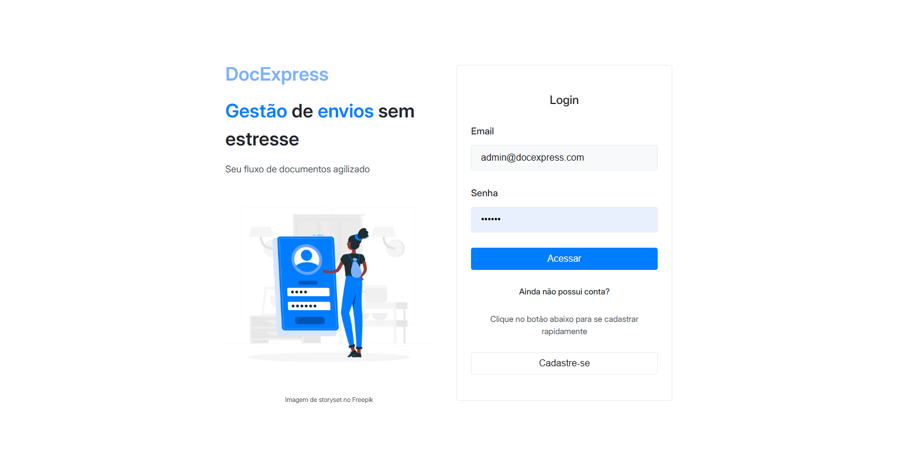
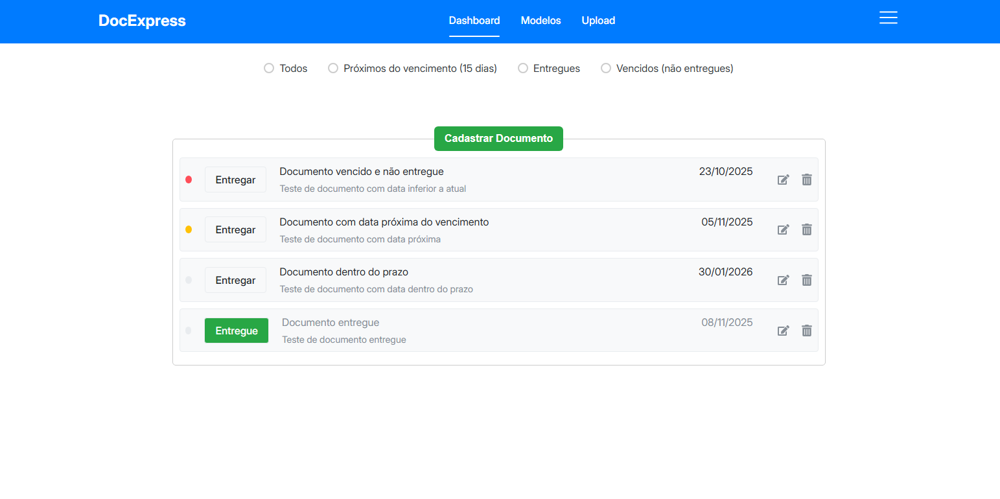
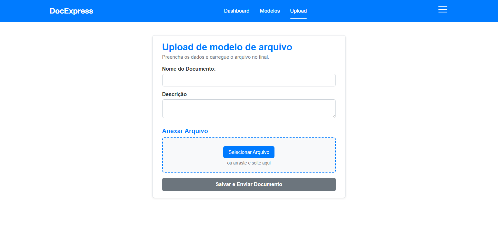
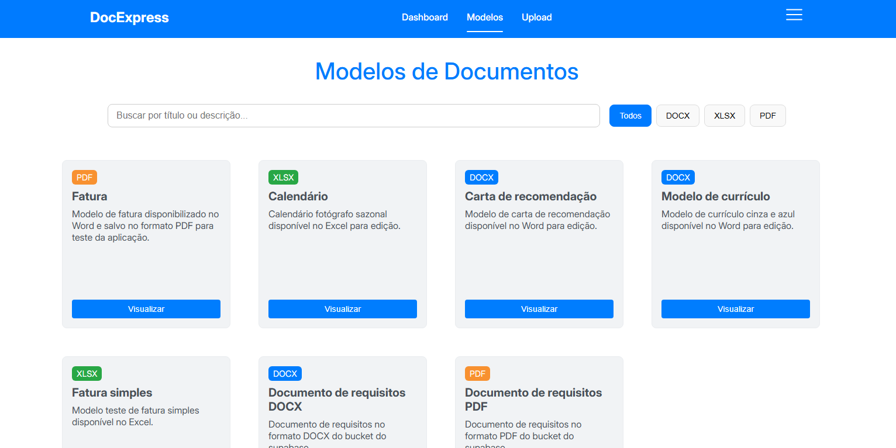

# DocExpress Frontend


Aplicação **DocExpress** — interface web desenvolvida em **React** com **JavaScript**, **TypeScript**, **HTML** e **SCSS**, como parte do projeto integrador do curso de Ciência da Dados da UNIVESP.

O projeto visa gerenciar tarefas e documentos de forma simples, intuitiva e segura, permitindo o upload, edição e exclusão de modelos de documentos, além de filtros avançados e controle de permissões de administrador.

---

## 🌐 Links do Projeto

- **Frontend (Vercel):** [https://pi-creche.vercel.app/](https://pi-creche.vercel.app/)
- **Backend (Render):** [https://doc-express-backend.onrender.com/](https://doc-express-backend.onrender.com/)
- **Repositório Frontend:** [https://github.com/projeto-integrador-comp/doc_express_FrontEnd](https://github.com/projeto-integrador-comp/doc_express_FrontEnd)
- **Repositório Backend:** [https://github.com/projeto-integrador-comp/doc_express_BackEnd](https://github.com/projeto-integrador-comp/doc_express_BackEnd)

---

## 📋 Funcionalidades

### 🔹 Funcionalidades desenvolvidas anteriormente

- Página de **login/cadastro de usuários**.
- Página de **cadastro de tarefas**, com filtros por:
  - Tarefas **vencidas**
  - Tarefas **próximas do vencimento**
  - Tarefas **dentro do prazo**
- Marcadores visuais para facilitar a identificação das tarefas.

### 🔹 Funcionalidades adicionadas

- Página para **upload de modelos de documentos** utilizados nas entregas das tarefas.
- Página de **listagem de modelos cadastrados**, com as opções de:
  - **Download** do documento.
  - **Edição** de informações (apenas administradores).
  - **Exclusão** de modelos (apenas administradores).
- Filtros na listagem de documentos:
  - Por **tipo de arquivo**: `.pdf`, `.xlsx`, `.docx`
  - Por **palavras-chave** no título ou descrição.

---

## 🧩 Tecnologias Utilizadas

- **React.js**
- **TypeScript**
- **JavaScript (ES6+)**
- **HTML5 / SCSS**
- **Axios** para consumo da API.
- **Supabase** (modo produção) e **armazenamento local em uploads/templates** (modo local).

---

## ⚙️ Configuração do Ambiente

### 1. Clonar o repositório

```bash
git clone https://github.com/projeto-integrador-comp/doc_express_FrontEnd.git
cd doc_express_FrontEnd
```

### 2. Instalar dependências

```bash
npm install
```

### 3. Configurar variáveis de ambiente

O arquivo de exemplo `.env.example` está disponível na raiz do projeto.  
Crie um arquivo `.env` com base nele e preencha as variáveis conforme o ambiente (produção ou local).

```bash
cp .env.example .env
```

### 4. Executar o projeto

#### Modo desenvolvimento

```bash
npm run dev
```

#### Modo produção

```bash
npm run build
npm start
```

---

## 🗄️ Integração com Backend

A aplicação se conecta ao backend hospedado no **Render**.  
Em ambiente local, caso não haja conexão com o **Supabase**, os arquivos enviados são armazenados na pasta `/uploads/templates` dentro do backend local.

---

## 🧠 Arquitetura e Estrutura

```
src/
├── assets/               # Imagens, ícones e outros arquivos estáticos utilizados no projeto
│
├── components/           # Componentes reutilizáveis da interface
│   ├── Button/           # Botões genéricos e estilizados
│   ├── DocumentList/     # Lista de documentos com filtros e ações (download, edição, exclusão)
│   ├── Forms/            # Formulários reutilizáveis (login, cadastro, upload, etc.)
│   ├── Header/           # Cabeçalho principal da aplicação
│   ├── Loading/          # Componente visual de carregamento
│   ├── Modals/           # Janelas modais (confirmação, edição, exclusão)
│   └── ModelList/        # Listagem dos modelos de documentos cadastrados
│
├── pages/                # Páginas principais da aplicação
│   ├── DashboardPage/    # Página inicial após login, com visão geral das tarefas/documentos
│   ├── ErrorPage/        # Página exibida em caso de erro de rota ou acesso não permitido
│   ├── LoadingPage/      # Tela de carregamento usada entre redirecionamentos
│   ├── ModelListPage/    # Página para listagem, download e gerenciamento de modelos
│   ├── RegisterPage/     # Página de cadastro de novo usuário
│   └── UploadPage/       # Página para upload de novos modelos de documentos
│
├── providers/            # Contextos globais (React Context API)
│   ├── DocumentoContext/ # Contexto responsável por gerenciar os dados dos documentos
│   ├── ModelContext/     # Contexto de controle dos modelos (templates)
│   └── UserContext/      # Contexto de autenticação e informações do usuário logado
│
├── routes/               # Controle de rotas da aplicação (React Router)
│   ├── PrivateRoutes/    # Rotas protegidas, acessíveis apenas com autenticação válida
│   ├── PublicRoutes/     # Rotas públicas (login, registro)
│   └── index.jsx         # Arquivo principal que organiza e exporta todas as rotas
│
├── services/             # Serviços e configurações externas
│   ├── api.js            # Configuração base da API (Axios)
│   └── supabaseClient.ts # Configuração opcional do cliente Supabase (armazenamento em nuvem)
│
├── styles/               # Estilos globais (SCSS Modules e variáveis de tema)
│
├── App.jsx               # Componente raiz que organiza rotas, providers e layout geral
└── main.jsx              # Ponto de entrada da aplicação React
```

---

## 🧑‍💼 Perfis de Usuário

- **Usuário comum:** pode visualizar e baixar modelos.
- **Administrador:** pode **editar**, **excluir** e **gerenciar** documentos.

---

## 🖼️ Demonstrações do Projeto

Abaixo estão algumas telas da aplicação em funcionamento:

### 🔐 Tela de Login



### 📝 Cadastro de Tarefas



### 📤 Upload de Documentos



### 📂 Listagem de Modelos



---

## 🤝 Colaboradores

Este projeto foi desenvolvido como parte do **Projeto Integrador - UNIVESP**, com a colaboração de estudantes do curso de **Ciência da Dados**.

<table align="center">
  <tr>
    <td align="center">
      <a href="https://github.com/julianohbl">
        <br>
        <sub><b>Juliano Lima</b></sub>
      </a>
    </td>
    <td align="center">
      <a href="https://github.com/Miguel-Lucio">
        <br>
        <sub><b>Miguel Lucio</b></sub>
      </a>
    </td>
    <td align="center">
      <a href="https://github.com/felipecsr">
        <br>
        <sub><b>Felipe Reis</b></sub>
      </a>
    </td>
    <td align="center">
      <a href="https://github.com/">
        <br>
        <sub><b>Felipe </b></sub>
      </a>
    </td>
  </tr>
  <tr>
    <td align="center">
      <a href="https://github.com/Nu-li">
        <br>
        <sub><b>Layla Nechy</b></sub>
      </a>
    </td>
    <td align="center">
      <a href="https://github.com/Henrique-Kriguer">
        <br>
        <sub><b>Henrique Kriguer</b></sub>
      </a>
    </td>
    <td align="center">
      <a href="https://github.com/rubenslaurindo">
        <br>
        <sub><b>Rubens Laurindo</b></sub>
      </a>
    </td>
    <td align="center">
      <a href="https://github.com/">
        <br>
        <sub><b>Abiratan</b></sub>
      </a>
    </td>
  </tr>
</table>
